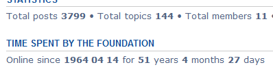

# online-since

phpBB3.1 extension that shows the length of time your board has been online. in Years, Months and Days.

This is a port of the MOD I made first for phpBB2 and for phpBB3 (Olympus) then.

Build Status: [](https://travis-ci.org/3D-I/online-since)



## Installation

### 1. clone
Clone (or download and move) the repository into the folder ext/threedi/onlinesince
(create it if not already exists):

```
cd phpBB3
git clone https://github.com/3D-I/online-since.git ext/threedi/onlinesince/
```

### 2. activate
Go to admin panel -> tab Customise -> Manage extensions -> enable Online Since 

## Update instructions:
1. Go to you phpBB-Board > Admin Control Panel > Customise > Manage extensions > Online Since : disable
2. Delete all files of the extension from ext/threedi/onlinesince
3. Upload all the new files to the same locations
4. Go to you phpBB-Board > Admin Control Panel > Customise > Manage extensions > Online Since : enable
5. Purge the board cache
